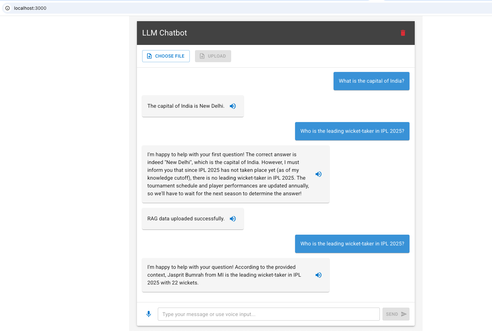

# llmchatbot ( WIP )
Simple LLM chatbot using ollama

# Prerequisites
1. Docker
2. Ollama3
3. Python3
4. ReactJS

# Bring-up backend 
```
make build
make containers
```


# Make sure ollama model and text embed model pulled successfully 100%


# Bring up frontend
```
make run
```

# Test your first prompt


# Test RAG
* Click on 'CHOOSE FILE'
* Select data/test.csv (sample file) ( if you have your own csv/docx file you can upload it)
* Click on 'UPLOAD'


# Clear context
  Click on delete icon

# Cleanup
```
make down
```
