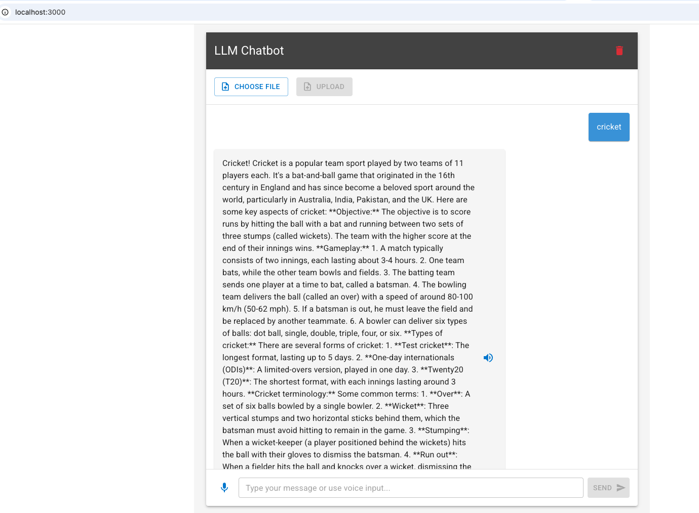

# llmchatbot 
Simple LLM chatbot using ollama

# Prerequisites
1. Docker (https://docs.docker.com/desktop/setup/install/mac-install/)
2. Ollama3 (https://ollama.com/library/llama3)
3. Python3
4. ReactJS

# Bring-up backend 
```
make build
make containers-with-cpu ( slow response with cpu )
or
make containers-with-gpu ( fast LLM response, but make sure you have nvidia driver installed and 'nvidia-smi' command works in CLI)
```


# Make sure ollama model and text embed model pulled successfully 100%


# Bring up frontend
```
make run
```

# Test your first prompt


# Test RAG
* Click on 'CHOOSE FILE'
* Select data/test.csv (sample file) ( if you have your own csv/docx file you can upload it)
* Click on 'UPLOAD'


# Voice support
Click on 'mic' icon and talk, your voice will be converted into words and Click on Send. Once the LLM responds, you can click on 'Speaker' icon to listen

# Clear context
  Click on delete icon

# Cleanup
```
make down
```
